# Unity 2D 클리커 게임
### 내일배움캠프 심화과제 팀프로젝트

## 프로젝트 설명
### 탭 히어로즈(Tap Heroes)
탭 히어로즈(Tap Heroes)는 탭 타이탄(Tap Titans) 스타일의 모바일 판타지 게임으로, 간단한 탭(Clicker) 시스템과 RPG 요소를 결합한 게임입니다.

## 제작기간
### 2025.03.20 ~ 2025.04. 02

## 7일후에세상멸망(7조) 팀원
|     이름     |                    파트                     |
| :----------: | :-----------------------------------------: |
| 허유지(팀장) |    무기 및 업그레이드 & 인벤토리 시스템     |
|    박진우    |               적 및 스테이지                |
|    김상현    | 플레이어 능력치 및 업그레이드 & 업적 시스템 |
|    이건우    |         클릭 이벤트 & 히어로 시스템         |
|    김학영    |            게임 매니저 & UI 관리            |
</details>

## 기술 스택
- Unity 2022.3.17f1
- C#
- Json
- DoTween

## 게임 프리뷰
[]()  

## 주요 기능
### 시작 화면
[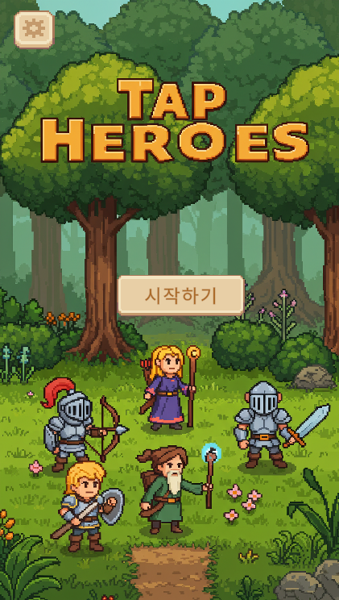]()  
시작 화면을 통해서 게임을 새로 시작하거나 저장된 데이터를 불러 낼 수 있습니다.  
그리고 왼쪽 상단의 설정을 클릭하여 볼륨도 조절 할 수 있습니다.  

### 플레이어 업그레이드 탭
[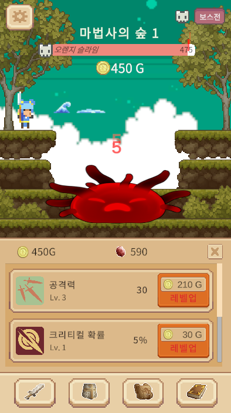]()  
게임 시작 시 플레이어 업그레이드 탭이 자동으로 올라 와 있으며 몬스터를 클릭하여 공격 할 수 있습니다.  
몬스터를 클릭했을 때 입히는 데미지를 해당 탭을 통하여 강화 할 수 있으며 다른 탭을 클릭하여 탭 간의 이동을 할 수 있습니다.  

### 영웅 탭
[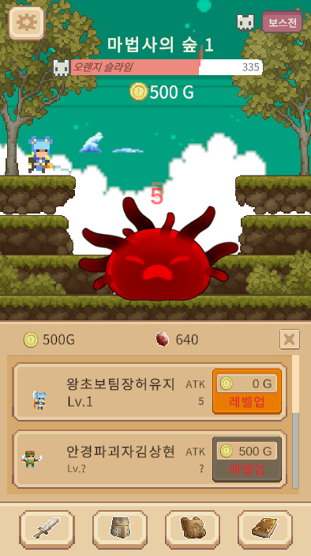]()  
영웅 탭에서는 맨 위쪽 영웅을 구매하면 점차 아래의 영웅을 구입 할 수 있도록 하는 해금 시스템으로 되어 있습니다.  

### 무기 탭
[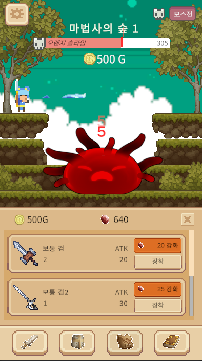]()  
무기 탭에서는 무기를 업그레이드 하여 `장착`버튼을 통해 해당 무기를 장착하여 탭간의 공격력을 올릴 수 있습니다.  

### 무기 탭 - 장착 확인
[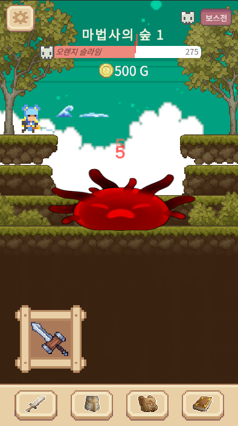]()  
무기 탭에서 장착된 무기가 무엇인지는 탭을 x표시로 비활성화 하면 볼 수 있습니다.  

### 보상 탭
[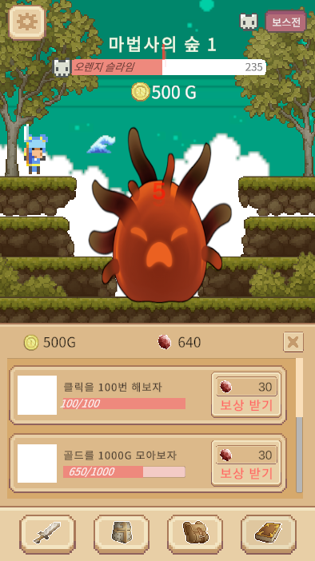]()  
퀘스트를 완료하여 재화를 얻을 수 있습니다.  

### 재화 부족 시
[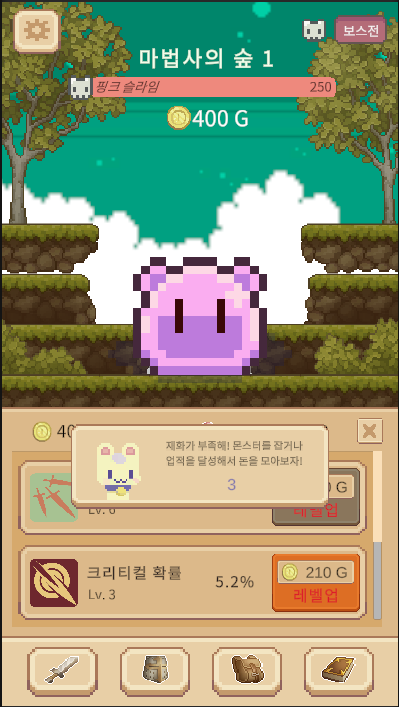]()  
재화 부족 시 알림창이 5초간 나옵니다.

### 설정 탭
[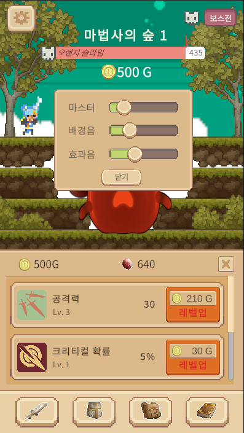]()  
설정 탭을 클릭하면 사운드를 조절 할 수 있습니다.  

### 전투 시스템
[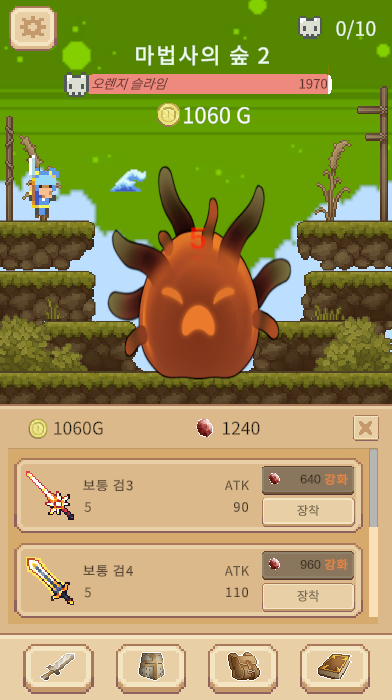]()  
스테이지가 시작되면 우측 상단에 해당하는 몬스터 처치 수를 채워야지만 보스전에 도전 할 수 있는 버튼이 활성화 됩니다.  
해당 라운드마다 처음으로 몬스터 처치 수를 다 채우면 자동으로 보스 방으로 이동하며 보스전에서 패배 하였을 시 다시 기본 몬스터와의 전투로 이동되며 이때는 보스전이라는 버튼이 활성화되어 해당 버튼을 클릭하여야 보스방으로 이동 할 수 있습니다.  
  
### 보스와의 전투
[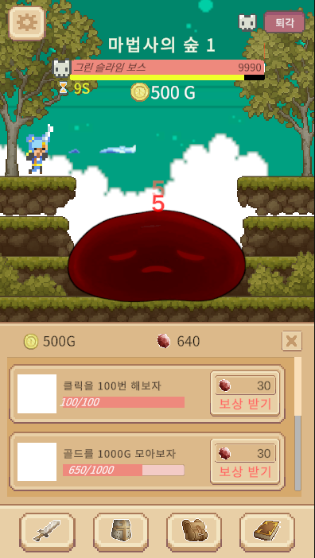]()  
보스와 전투 시에는 시간초가 존재하며 해당 시간안에 보스를 처치하면 다음 스테이지로 이동 할 수 있습니다.  
  
## 트러블 슈팅
### 허유지님
```C#
 public void WeaponEquipped(WeaponSlot weaponSlot, WeaponData selectedWeapon)
 {
     if (currentEquippedWeapon != null)
     {
         player.atk -= currentEquippedWeapon.ability;
     }

     currentEquippedWeapon = selectedWeapon;
     CurrentWeapon.sprite = selectedWeapon.Icon;
     player.atk += selectedWeapon.ability;

     SaveLoadManager.instance.SaveAllData();
     AchievementManager.instance.IncreaseAchievementProgress(AchievementType.Weapon , 1);
 }
```
  
> #### 문제 발생  
> 무기 장착시 해당 WeaponData의 공격력 값을 무한히 플레이어에게 할당 가능한 문제
>   
> #### 해결책   
> currentEquippedWeapon이라는 변수에 플레이어가 장착했던 무기 정보를 저장 후 장착 버튼을 누를 때 마다 변수에 저장 된 공격력 값을 빼 줆.
> 
> #### 느낀점  
> 이번 프로젝트 전까지 지식 부족으로 인벤토리 시스템을 완벽히 구현한 적이 없었는데, 이번 기회를 맞아 인벤토리 기능을 어느정도 완성해보았던 것 같아 무척 기분이 뿌듯했습니다. 다들 넘넘 고생하셨습니다 짱!!!


### 박진우님
[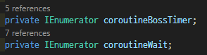]()
[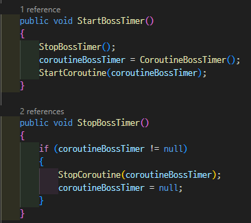]()

> #### 문제 발생  
> 해당 오브젝트에서 코루틴이 한번에 꺼지는  문제 발생
>  
> #### 원인
> StopAllCoroutines();을 사용해서 해당 오브젝트의 모든 코루틴이 종료 됨을 확인
>  
> #### 해결책   
> coroutineBossTimer와, coroutineWait로 멤버변수를 만든 뒤  
> 위와 같은 방식을 사용하여 코루틴의 실행, 중지를 각각 만들어줌
>  
> #### 느낀점  
> **코드를 만들 때 너무 근시적인 시야를 갖고 만들었던 것을 반성하게 되었다.**  
> **다음에 코드 짤 때에는 좀 더 확장성 있는 방식으로 만들어 보려고 노력해야겠다.**

### 김상현님
> #### 문제 발생  
> SO를 통해서, 플레이어의 레벨을 가지고 와 스탯을 환산 하려는 구조를 생각함 →  
> 빌드시에 SO는 읽기 전용이라 동적인 데이터를 저장 못함 → 빌드 이후, 인게임에서는 저장이 되지만 게임을 껐다가 키면, 데이터가 날라가는 이슈
> 
> #### 해결책   
> json을 통해 값을 저장하고, 그 값을 참조하여, 레벨 및 재화를 가져와서 그 값을 스탯으로 환산하여 값을 사용함  
> SO를 사용해 구조를 짰기에, 내가 제작한 코드들을 전부 갈아 엎어야했음
> 위와 같은 방식을 사용하여 코루틴의 실행, 중지를 각각 만들어줌
> 
> #### 느낀점  
> SO에 대해 무지하여, 이런 방법으로 짜볼까 했지만, 고정 값을 사용하는 것이 아니면 SO를 사용 안하는것이 맞다..


### 이건우님
[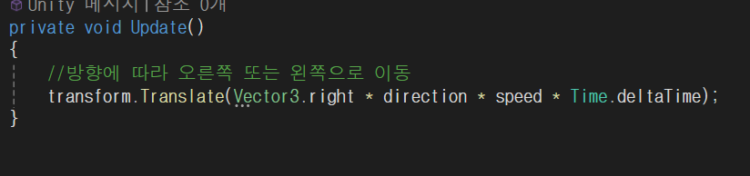]()
[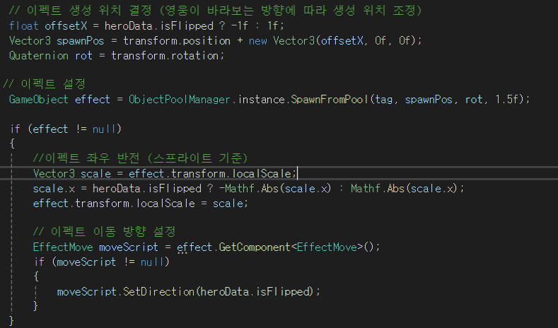]()

> #### 문제 원인
> 스프라이트 를 좌우반전시킨 히어로가 있는데 그히어로의경우 이펙트도 반전을 시켜줘야합니다  
> 그런데 이펙트의 단순한 좌우반전으로는 처음 시작위치만 바뀌고 진행방향은 그대로라 영웅이 바라보는방향이아니고 반대로날아갑니다  
>  
> #### 해결책   
> 이동방향 벡터까지 설정해줘야 자연스럽게 이펙트 구현가능했습니다
>  
> #### 느낀점  
> 단순하게 이펙트를 좌우반전시키면 앞으로 `>>>>` 이렇게 가던게 뒤집혀서
`<<<<` 이렇게 가겠지 하는생각으로 했는데 컴퓨터는 역시 모든정보를 줘야하는구나 생각했습니다.


### 김학영님
[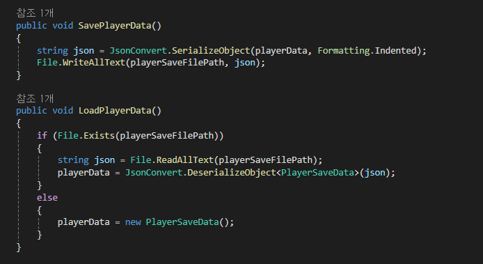]()

> #### 문제 원인
> 세이브 및 로드가 되지 않는 문제, 코드 리팩토링
>  
> #### 해결책   
> 1. 원래는 제너릭을 이용해서 모든 데이터를 한꺼번에 저장하려고 하였으나, 팀원들의 저장편의성을 위하여 각각의 저장 경로를 만들어 메서드를 구분하였다. 
>     
> 2. 데이터의 핵심 중추가 되는 GameManager와 PlayerData에서 데이터를 가져다 쓰는 형식으로 구현하는 것이 좋다. 그래야 GameManager가 싱글톤인 이유가 살고 저장 및 로드도 깔끔해졌을 것이다.
> 3. PlayerData의 경우 float, int 형식만 받아올 수 있다. 딕셔너리가 있는 데이터의 경우 뉴턴제이슨 방법을 사용해서 제이슨 파일로 전환하면 해결할 수 있다.
>  
> #### 느낀점  
> 데이터 프레임워크를 팀원들과 합의하고 큰 구조를 먼저 그리고 시작했으면 코드구현이 더 깔끔했을 것 같다. 또한 DOTween을 처음 써봤는데 다음 번엔 애니메이션까지 구현하고 싶다.


## 라이선스
|              에셋 이름               |                                      출처                                      |    라이선스    |
| :----------------------------------: | :----------------------------------------------------------------------------: | :------------: |
|               DoTween                | https://assetstore.unity.com/packages/tools/animation/dotween-hotween-v2-27676 |  MIT License   |
|   MiniFolks Plus - Elements Heroes   |             https://dreamir.itch.io/minifolks-plus-elements-heroes             | Custom License |
|              Momo Slime              |                    https://chiecola.itch.io/momo-slime-mob                     | Custom License |
|             Mossy Cavern             |                       https://maaot.itch.io/mossy-cavern                       | Custom License |
| Pixel Art Platformer - Village Props |           https://cainos.itch.io/pixel-art-platformer-village-props            | Custom License |
|          STRINGSTAR FIELDS           |                  https://trixelized.itch.io/starstring-fields                  |  MIT License   |
|         Sprout Lands UI Pack         |                 https://cupnooble.itch.io/sprout-lands-ui-pack                 | Custom License |
|     Ninja Adventure - Asset Pack     |              https://pixel-boy.itch.io/ninja-adventure-asset-pack              |      CC0       |
